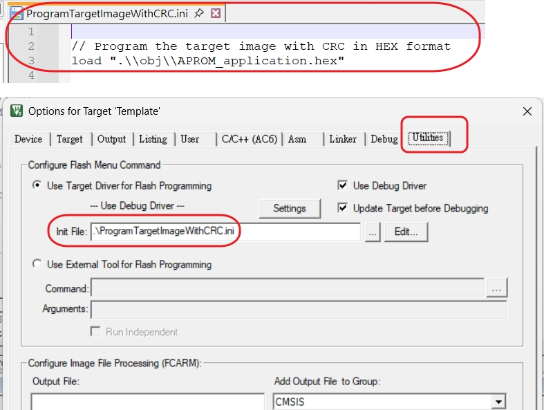
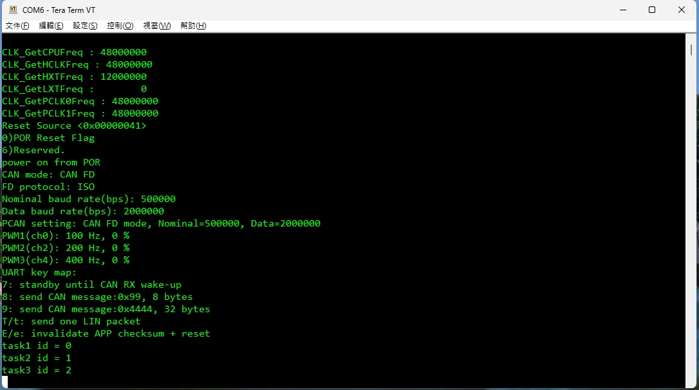
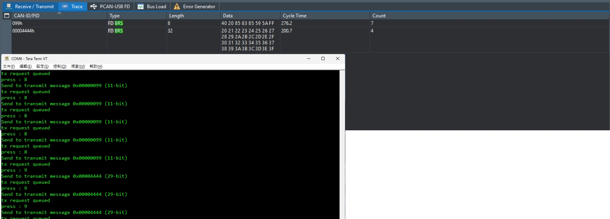
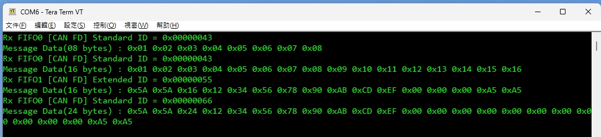
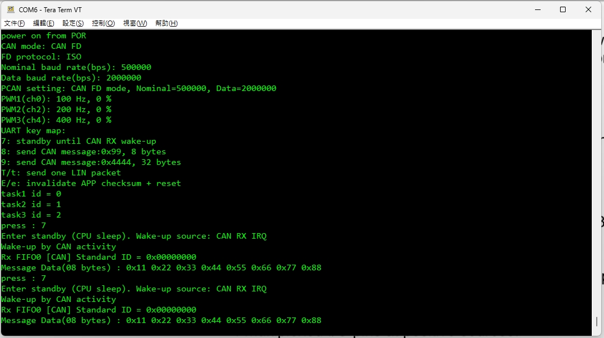
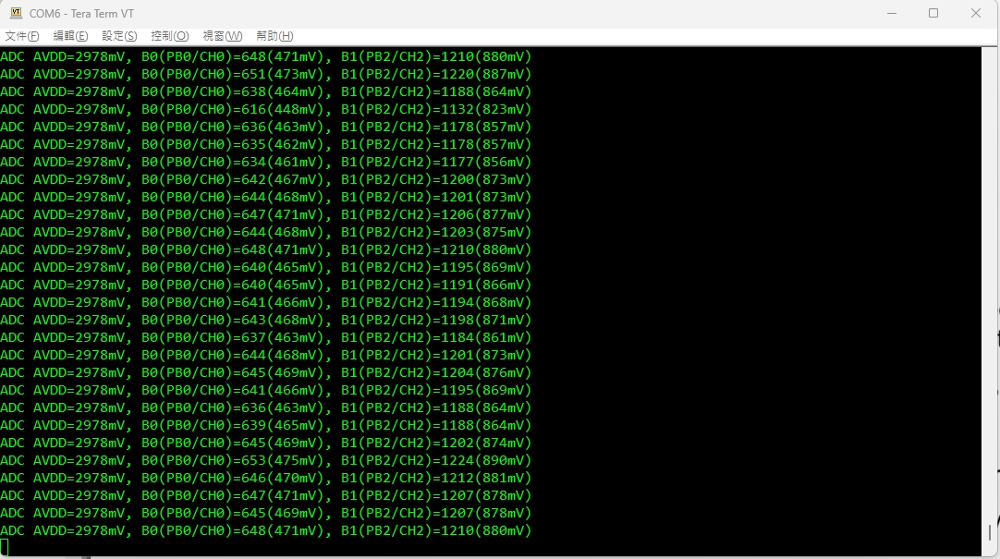
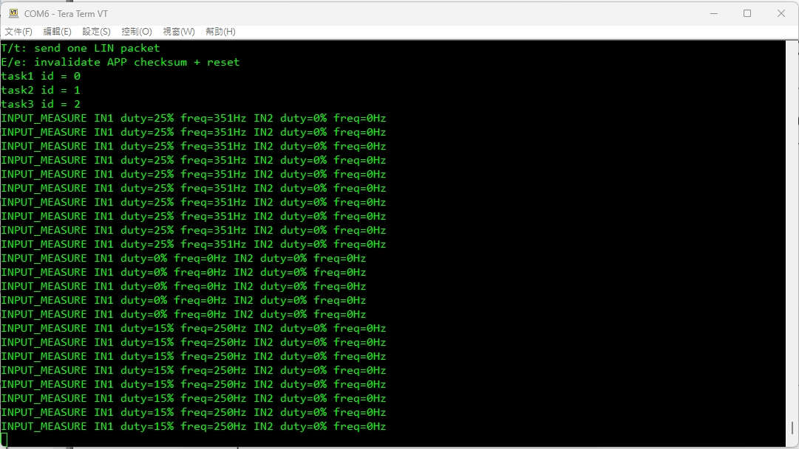

# M2A23BSP_ISP_CAN_PWM_LIN

M2A23 BSP example for:

- `LDROM` CAN ISP bootloader
- `APROM` application with checksum
- `CAN FD`, `PWM`, `ADC`, `GPIO input measure`
- optional `LIN` test flow

Update: `2026/06/27`

## Overview

- MCU / Series:
  `M2A23`
- Board:
  EVB style pinout with external signal and bus test
- Toolchain:
  `Keil uVision5`
- Purpose:
  - verify `LDROM -> APROM` CAN ISP boot flow
  - verify `APROM` checksum handling by `SRecord`
  - verify `CAN FD TX/RX` and CAN wake-up
  - verify `WDT` reset protection in normal run flow
  - verify PWM output, ADC sampling, and external pulse frequency / duty measurement

## Hardware

- Bootloader debug UART:
  `UART1`, `PB6=RXD1`, `PB7=TXD1`
- Application debug UART, default:
  `UART0`, `PB12=RXD0`, `PB13=TXD0`
- Application debug UART, smart config option:
  `UART1`, `PB6=RXD1`, `PB7=TXD1`
- CAN:
  `CANFD0`, `PC4=RXD`, `PC5=TXD`
- ADC inputs:
  `PB0=ADC0_CH0`, `PB2=ADC0_CH2`
- PWM outputs:
  `PB1=PWM0_CH4`, `PB3=PWM0_CH2`, `PF5=PWM0_CH0`
- BPWM output:
  `PA3=BPWM0_CH3`, `250Hz`, default `0%`
- External pulse inputs:
  `PB5=INT0`, `PB4=INT1`
- Test equipment:
  serial terminal, CAN analyzer / PCAN, oscilloscope

## Pin Map

| Function | Pin | Direction | Note |
| --- | --- | --- | --- |
| `UART0_RXD` | `PB12` | Input | AP debug UART, default |
| `UART0_TXD` | `PB13` | Output | AP debug UART, default |
| `UART1_RXD` | `PB6` | Input | LDROM boot debug UART |
| `UART1_TXD` | `PB7` | Output | LDROM boot debug UART |
| `CANFD0_RXD` | `PC4` | Input | CAN / CAN FD bus |
| `CANFD0_TXD` | `PC5` | Output | CAN / CAN FD bus |
| `ADC0_CH0` | `PB0` | Input | ADC channel B0 |
| `ADC0_CH2` | `PB2` | Input | ADC channel B1 |
| `PWM0_CH4` | `PB1` | Output | PWM group 3, `400Hz` |
| `PWM0_CH2` | `PB3` | Output | PWM group 2, `200Hz` |
| `PWM0_CH0` | `PF5` | Output | PWM group 1, `100Hz` |
| `BPWM0_CH3` | `PA3` | Output | BPWM output, `250Hz`, default `0%` |
| `INT0` | `PB5` | Input | input measure channel 1 |
| `INT1` | `PB4` | Input | input measure channel 2 |
| `LED1~LED3` | `PA0~PA2` | Output | GPIO output mirror |
| `LED4` | `PA3` | Disabled by define | switched to `BPWM0_CH3` when `DRV_GPIO_LED_SET4_GPIO_ENABLE = 0` |
| `LED5~LED6` | `PA4~PA5` | Output | GPIO output mirror |
| `SW1~SW4` | `PA15~PA12` | Input | GPIO input |
| `SW5~SW6` | `PC0~PC1` | Input | GPIO input |

When `ENABLE_LIN_BUS == 1`:

- AP debug UART moves to `UART0`, `PA6=RXD0`, `PA7=TXD0`
- LIN bus uses `UART1`, `PB6=RXD1`, `PB7=TXD1`

For current AP debug UART selection in source:

- if using EVB debug connection, keep `UART0`
- if following smart config usage, switch debug UART to `UART1`

Code location:

- [main.c](SampleCode/Template/AP/main.c)

```c
#if 0
#define APP_DEBUG_UART                                  UART1
#define APP_DEBUG_UART_RST                              UART1_RST
#define APP_DEBUG_UART_IRQn                             UART1_IRQn
#define APP_DEBUG_UART_IRQHandler                       UART1_IRQHandler
#else   //EVB  DEBUG
#define APP_DEBUG_UART                                  UART0
#define APP_DEBUG_UART_RST                              UART0_RST
#define APP_DEBUG_UART_IRQn                             UART0_IRQn
#define APP_DEBUG_UART_IRQHandler                       UART0_IRQHandler
#endif
```

.jpg)

## Build Environment

- BSP / SDK:
  Nuvoton `M2A23` BSP
- IDE / compiler:
  `Keil uVision5`
- Project paths:
  - AP: [SampleCode/Template/AP/Keil/Template.uvprojx](SampleCode/Template/AP/Keil/Template.uvprojx)
  - ISP: [SampleCode/Template/ISP_CAN/Keil/Template.uvprojx](SampleCode/Template/ISP_CAN/Keil/Template.uvprojx)
- Output images:
  - LDROM bootloader image
  - APROM application image with CRC32 at the last 4 bytes

## Project Layout

- AP application:
  [SampleCode/Template/AP](SampleCode/Template/AP)
- LDROM CAN ISP bootloader:
  [SampleCode/Template/ISP_CAN](SampleCode/Template/ISP_CAN)
- Memory map:
  [SampleCode/Template/memory_map.h](SampleCode/Template/memory_map.h)
- AP checksum tool:
  [SampleCode/Template/AP/Keil/checksum_config.cmd](SampleCode/Template/AP/Keil/checksum_config.cmd)
  [SampleCode/Template/AP/Keil/generateChecksum.bat](SampleCode/Template/AP/Keil/generateChecksum.bat)

## Flash Layout

Unified flash layout:

- `LDROM` holds CAN ISP bootloader
- `APROM` holds application image
- application checksum is stored at the last 4 bytes of APROM image

| Region | Address | Size | Note |
| --- | --- | --- | --- |
| `LDROM` | `0x00100000 ~ 0x00100FFF` | `4KB` | CAN ISP bootloader |
| `APROM` | `0x00000000 ~ 0x0000FFFF` | `64KB` | application image |
| `APP checksum` | `0x0000FFFC` | `4 bytes` | CRC32 at end of AP image |

Related files:

- [memory_map.h](SampleCode/Template/memory_map.h)
- [checksum_config.cmd](SampleCode/Template/AP/Keil/checksum_config.cmd)

## LDROM CAN ISP

Bootloader project:

- [SampleCode/Template/ISP_CAN/main.c](SampleCode/Template/ISP_CAN/main.c)

Behavior:

- runs in `LDROM`
- uses `Classical CAN`, `500 kbps`
- debug UART is `UART1`
- validates AP image by:
  - stack pointer range
  - reset vector range and Thumb bit
  - CRC32 at `APP_CHECKSUM_ADDR`
- if AP is valid, bootloader quickly jumps to AP
- if AP is invalid, bootloader stays in CAN ISP mode

CAN ISP IDs:

- master request ID: `0x487`
- device response ID: `0x784`

Supported command groups in current bootloader:

- read device ID
- read config word
- write APROM data
- run APROM

Programming note:

- AP image CRC is generated by post-build script
- Nu-Link programming flow can use the settings shown below



## APROM Application

Application project:

- [SampleCode/Template/AP/main.c](SampleCode/Template/AP/main.c)

Typical power-on log includes:

- clock information
- reset source
- CAN mode / baud rate
- PWM startup status
- UART key map
- timer task IDs

Image:



### UART Key Map

- `7`
  enter standby and wait for CAN RX wake-up
- `8`
  send CAN SID `0x99`, `8 bytes`
- `9`
  send CAN XID `0x4444`, `32 bytes`
- `T/t`
  send one LIN packet
- `E/e`
  invalidate APP checksum and reset

Note:

- `LIN` code path exists, but current default is `ENABLE_LIN_BUS = 0`
- current default log setting is:
  - `ENABLE_ADC_LOG = 1`
  - `ENABLE_INPUT_MEASURE_LOG = 0`

### GPIO / BPWM Define

Related files:

- [drv_gpio_io.h](SampleCode/Template/AP/drv_gpio_io.h)
- [drv_pwm.h](SampleCode/Template/AP/drv_pwm.h)
- [drv_pwm.c](SampleCode/Template/AP/drv_pwm.c)

Current `PA3` behavior is controlled by:

```c
#define DRV_GPIO_LED_SET4_GPIO_ENABLE                   (0U)
```

PWM / BPWM driver defines:

```c
#define DRV_PWM_GROUP1_CHANNEL                          (0U)
#define DRV_PWM_GROUP2_CHANNEL                          (2U)
#define DRV_PWM_GROUP3_CHANNEL                          (4U)
#define DRV_PWM_GROUP1_FREQ_HZ                          (100UL)
#define DRV_PWM_GROUP2_FREQ_HZ                          (200UL)
#define DRV_PWM_GROUP3_FREQ_HZ                          (400UL)
#define DRV_BPWM_CHANNEL                                (3U)
#define DRV_BPWM_FREQ_HZ                                (250UL)
```

Meaning:

- `1U`
  `PA3` stays as `LED_SET4` GPIO output
- `0U`
  `PA3` GPIO mirror is disabled
  `PA3` is switched to `BPWM0_CH3`

Current GPIO / BPWM related pin defines:

```c
#define LED_SET1                                        (PA0)
#define LED_SET2                                        (PA1)
#define LED_SET3                                        (PA2)
#define LED_SET4                                        (PA3)
#define LED_SET5                                        (PA4)
#define LED_SET6                                        (PA5)
#define SW_1                                            (PA15)
#define SW_2                                            (PA14)
#define SW_3                                            (PA13)
#define SW_4                                            (PA12)
#define SW_5                                            (PC0)
#define SW_6                                            (PC1)
```

### Added BPWM Function

New API:

```c
void DRV_BPWM_SetOutputDutyCycle(uint8_t u8Duty);
```

Behavior:

- output pin:
  `PA3 = BPWM0_CH3`
- output frequency:
  fixed `250Hz`
- default startup duty:
  `0%`
- when duty is `0U`:
  output is forced to logic low
- integration note:
  `PA3` must be released from `LED_SET4` GPIO mode by setting `DRV_GPIO_LED_SET4_GPIO_ENABLE = 0U`

Usage example:

```c
DRV_BPWM_SetOutputDutyCycle(25U);
DRV_BPWM_SetOutputDutyCycle(50U);
DRV_BPWM_SetOutputDutyCycle(0U);
```

## Main Functions

### Watchdog Timer

Behavior:

- `WDT` is enabled in AP application startup
- WDT clock source is `LIRC`
- current setting:
  - timeout: `2^18` WDT clocks = `6.827s`
  - reset delay: `18` WDT clocks = `468.75us`
- `loop()` feeds WDT once per iteration by `WDT_RESET_COUNTER()`
- before entering key `7` standby wait, application closes WDT temporarily
- after CAN wake-up, application re-initializes WDT
- reset source log will show `WDT Reset` if watchdog timeout occurs

Related code:

- [main.c](SampleCode/Template/AP/main.c)

### Timeout / Delay Reference

Current WDT timeout table:

| TOUTSEL | Timeout | Time |
| --- | ---: | ---: |
| `0000` | `2^4` | `0.417 ms` |
| `0001` | `2^6` | `1.667 ms` |
| `0010` | `2^8` | `6.667 ms` |
| `0011` | `2^10` | `26.667 ms` |
| `0100` | `2^12` | `106.667 ms` |
| `0101` | `2^14` | `426.667 ms` |
| `0110` | `2^16` | `1.707 s` |
| `0111` | `2^18` | `6.827 s` |
| `1000` | `2^20` | `27.307 s` |

Current WDT reset delay table:

| Reset delay | Time |
| ---: | ---: |
| `3 clocks` | `78.125 us` |
| `18 clocks` | `468.75 us` |
| `130 clocks` | `3.385 ms` |
| `1026 clocks` | `26.719 ms` |

### CAN FD TX / RX

CAN application driver:

- [drv_can_fd.c](SampleCode/Template/AP/drv_can_fd.c)

Behavior:

- key `8` sends SID `0x99`, `8 bytes`
- key `9` sends XID `0x4444`, `32 bytes`
- received CAN / CAN FD frames are printed on UART
- specific SID `0xBC` is parsed into `g_au8CanRxDataBC[0..7]`

Images:





### CAN Wake-up

Behavior:

- key `7` enters CPU idle / standby wait state
- wake-up source is CAN RX IRQ
- wake-up result is printed after CAN activity

Image:



### PWM Output

PWM driver:

- [drv_pwm.c](SampleCode/Template/AP/drv_pwm.c)

Default outputs:

- `PWM0_CH0` on `PF5`: `100Hz`, `60%`
- `PWM0_CH2` on `PB3`: `200Hz`, `30%`
- `PWM0_CH4` on `PB1`: `400Hz`, `30%`

Startup log prints all three PWM groups.

### ADC Sampling

ADC driver:

- [drv_adc.c](SampleCode/Template/AP/drv_adc.c)

Behavior:

- samples `PB0/ADC0_CH0` and `PB2/ADC0_CH2`
- moving average is updated every `10ms`
- current default log prints:
  - cached `AVDD`
  - raw ADC code
  - converted voltage in `mV`

Image:



### External Pulse Measurement

GPIO input measure driver:

- [drv_gpio_io.c](SampleCode/Template/AP/drv_gpio_io.c)

Behavior:

- `PB5/INT0` measures channel 1 input pulse
- `PB4/INT1` measures channel 2 input pulse
- frequency / duty are measured from edge timestamps using `TIMER2` free-running counter
- input timeout returns channel result to `0Hz / 0%`

Current default:

- measurement remains active
- UART log is disabled by `ENABLE_INPUT_MEASURE_LOG = 0`

Reference image:



### LIN Test Path

LIN driver:

- [drv_lin_bus.c](SampleCode/Template/AP/drv_lin_bus.c)

Current default:

- `ENABLE_LIN_BUS = 0`

When enabled:

- LIN baud rate is `19200`
- test frame ID is `0x30`
- key `T/t` sends one LIN packet
- AP also listens for the same LIN frame

## Configuration

Main configuration files:

- [main.c](SampleCode/Template/AP/main.c)
- [drv_lin_bus.h](SampleCode/Template/AP/drv_lin_bus.h)
- [memory_map.h](SampleCode/Template/memory_map.h)

Important macros:

```c
#define ENABLE_LIN_BUS                  (0U)
#define ENABLE_ADC_LOG                  (1U)
#define ENABLE_INPUT_MEASURE_LOG        (0U)
#define APP_CHECKSUM_ADDR               (APP_END_ADDR - 4UL)
/* WDT is enabled in code by WDT_Init() */
```

Debug UART selection:

- EVB debug:
  use `UART0`
- smart config debug:
  change `APP_DEBUG_UART` group in [main.c](SampleCode/Template/AP/main.c) to `UART1`

## Test Flow

1. Build and program LDROM bootloader and APROM application.
2. Open UART terminal for boot or app log.
3. Connect CAN analyzer to `CANFD0`.
4. Power on or reset MCU.
5. Confirm power-on log, PWM status, and key map.
6. Trigger key `8` / `9` / `7` and confirm expected CAN behavior.
7. If WDT behavior is under test, temporarily stop feeding `WDT_RESET_COUNTER()` and confirm watchdog reset after about `6.827s`.
8. If ADC or pulse input is under test, inject analog / digital signal and compare UART log with scope or meter.

## Validation

- UART log:
  - power-on log
  - ADC log
  - CAN RX / TX log
  - wake-up log
  - WDT reset source log
- External tool:
  - PCAN or CAN analyzer should observe the configured IDs and payloads
- Scope:
  - PWM outputs should match `100Hz`, `200Hz`, `400Hz`
  - ADC input voltage and external pulse input can be cross-checked by oscilloscope

## Related Files

- [AP main](SampleCode/Template/AP/main.c)
- [ISP main](SampleCode/Template/ISP_CAN/main.c)
- [ADC driver](SampleCode/Template/AP/drv_adc.c)
- [PWM driver](SampleCode/Template/AP/drv_pwm.c)
- [GPIO input measure driver](SampleCode/Template/AP/drv_gpio_io.c)
- [CAN driver](SampleCode/Template/AP/drv_can_fd.c)
- [AP project file](SampleCode/Template/AP/Keil/Template.uvprojx)
- [ISP project file](SampleCode/Template/ISP_CAN/Keil/Template.uvprojx)

## Notes

- AP debug UART pinout changes when `ENABLE_LIN_BUS` is enabled.
- `AVDD` is currently calculated once during ADC init and reused in later ADC log output.
- Input measure function is active even when its UART log is disabled.
- CAN wake-up is based on CAN RX interrupt, not UART key input after entering standby.
- WDT is intentionally closed before standby wait and re-opened after CAN wake-up.

## Revision

- `2026/05/26`: rewrite README for current `ISP + CAN + PWM + ADC + LIN` project
- `2026/06/01`: add WDT behavior, timeout table, and standby interaction notes
